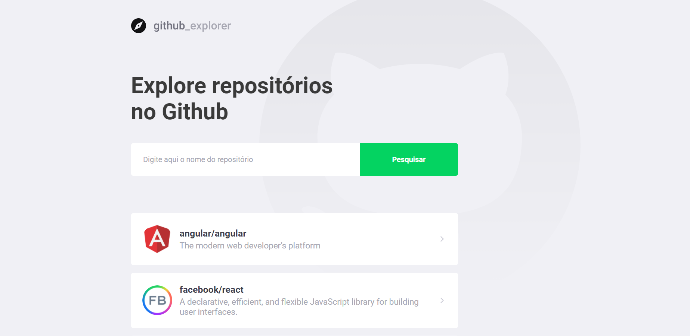

<h1 align="center">
    
</h1>

<h4 align="center"> 
	Github Explorer
</h4>

<p align="center">
  

  	
  
  <a href="https://github.com/Oppadayo/github-explorer/commits/master">
    
  </a>

  
   <a href="https://github.com/Oppadayo/github-explorer/stargazers">
    
  </a>
</p>


## 💻 Sobre o projeto

📚 Github Explorer - Aplicação desenvolvida para realizar pesquisas de repositórios utilizando a API do Github.

## 👨‍💻 Tecnologias

Essas são as tecnologias utilizadas nesse projeto
 
- [TypeScript]
- [React]
- [Styled-Components]

## 💻 Como usar

Para clonar e rodar essa aplicação você precisará do [Git](https://git-scm.com) e [Node.js](https://nodejs.org/en/download/) (que vem com [npm](http://npmjs.com)) instalado no seu computador. 
Na sua linha de comando:

### Clone esse repositório
```bash
# Digite o comando abaixo para clonar o repositório
$ git clone https://github.com/yuriduarte/github-explorer.git
```

### Iniciando o Projeto

```bash
# Vá para o repositório Back-end
$ cd github-explorer

# Instale as dependencias
$ yarn

# Para iniciar o servidor
$ yarn start
```


## 📝 License

Este projeto está sob a licença MIT. Consulte o [LICENSE](LICENSE.md) para obter detalhes.

---

Feito por Paula Correa 👋 Entre em contato comigo! ✉️ paula.correapcs@gmail.com   GitHub: github.com/oppadayo

